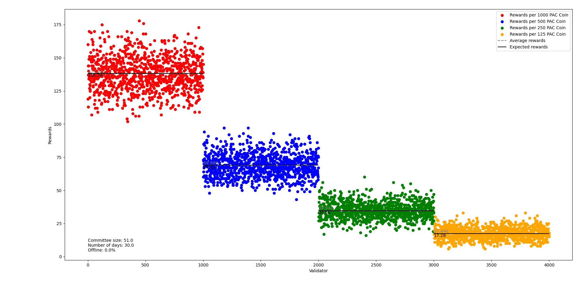

# Committee Simulator

The Committee Simulator is a simple app designed to simulate the committee of the [Pactus](https://pactus.org/) blockchain.



## How to run

A config file is provided where you can set the parameters of the committee, including:

- `committee_size`: Defines the size of the committee.
- `number_of_days`: Specifies the number of days the simulator should run.
- `offline_percentage`: Determines what percentage of the total stake is offline.
- `stakes`: Lists the validators' stakes. The first element is the amount of stake, while the second element is the number of validators.

Please note that you need to modify these parameters to suit your simulation needs.
After setting the parameters, you can run the simulator using the following command:

```
go run .
```